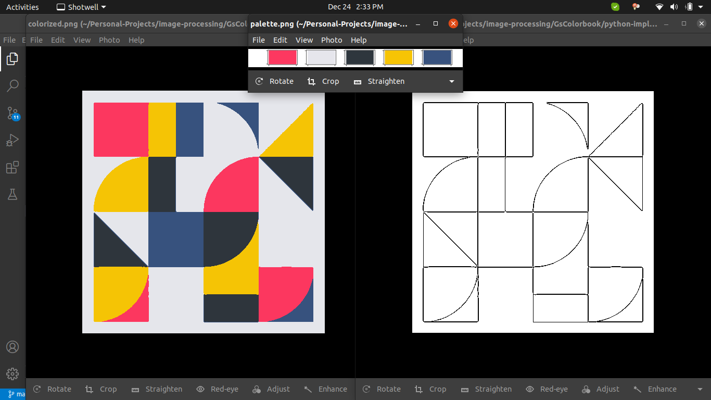
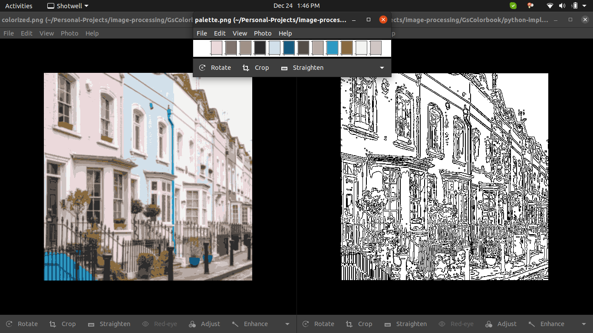
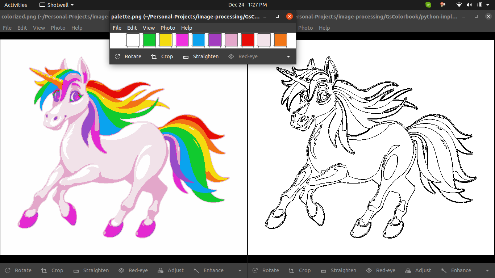

# Coloring Book Generator

This is a hobby project that generates a coloring book image along with a color palette, given any image.

It uses k-means clustering to find color centroids and consequently, generates a colorized image. It then performs Canny Edge Detection to generate an outlined color book image. A palette indicating the color centroids is also created.

## Results




## Prerequisites
* Python3 [3.8.5]
* NumPy [1.17.4]
* PIL [7.0.0]
* skimage [0.18.1]
* sklearn [0.23.2]

## Usage
```bash
$ cd python-implementation
$ python3 gscolorbook.py
```

## Customization

Currently, you can mention the image path in the `main()` function. Command-line arguments are coming soon!

```bash
colorbook = ColorBook("../images/abs.png")
```
The default number of colors in the palette (color centroids) is 10. However, you can change this as below.

```bash
self.color_centroids = 10
```

## What's Next

* Command-line arguments
* Experiment with more advanced clustering algorithms
* Option to choose beginner-advanced level coloring
* Hopefully a nice GUI!

## Contributing
Pull requests are welcome. For major changes, please open an issue first to discuss what you would like to change.

Please make sure to update tests as appropriate.

## License
[MIT](https://choosealicense.com/licenses/mit/)
